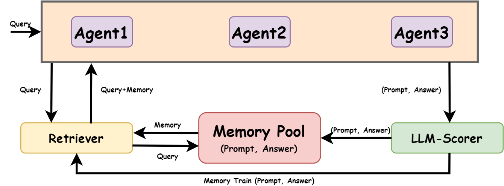
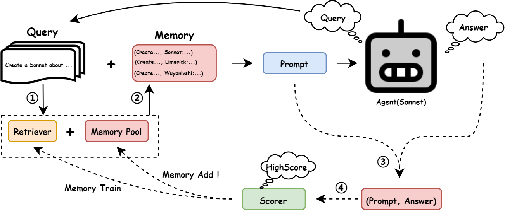

## Memory Sharing for Large Language Model based Agents

  

In the realm of artificial intelligence, the adaptation of Large Language Model (LLM)-based agents to execute tasks via natural language prompts represents a significant advancement, notably eliminating the need for explicit retraining or fine tuning for fixed-answer tasks such as common sense questions and yes/no queries. However, the application of In-context Learning to open-ended challenges, like poetry creation, reveals substantial limitations due to the comprehensiveness of provided examples and agent’s ability to understand the content expressed in the problem, leading to outputs that often diverge significantly from expected results. Addressing this gap, our study introduces the Memory-Sharing (MS) mechanism for LLM multi-agents, which utilizes a real-time memory storage and retrieval system to enhance the In-context Learning process. Each "memory" within this system captures both the posed query and the corresponding real-time response from an LLM-based agent, aggregating these memories from a broad spectrum of similar agents to enrich the memory pool shared by all agents. This framework not only aids agents in identifying the most relevant examples for specific tasks but also evaluates the potential utility of these memories for future applications by other agents. Empirical validation across three distinct domains involving specialized functions of agents demonstrates that the MS framework significantly improve the agent's performance regrading the open-ended questions. Furthermore, we also discuss what type of memory pool and what retrieval strategy in MS can better help agents, offering a future develop direction of MS. 

**An illustration of how the agent cooperate with the MS.**

  

