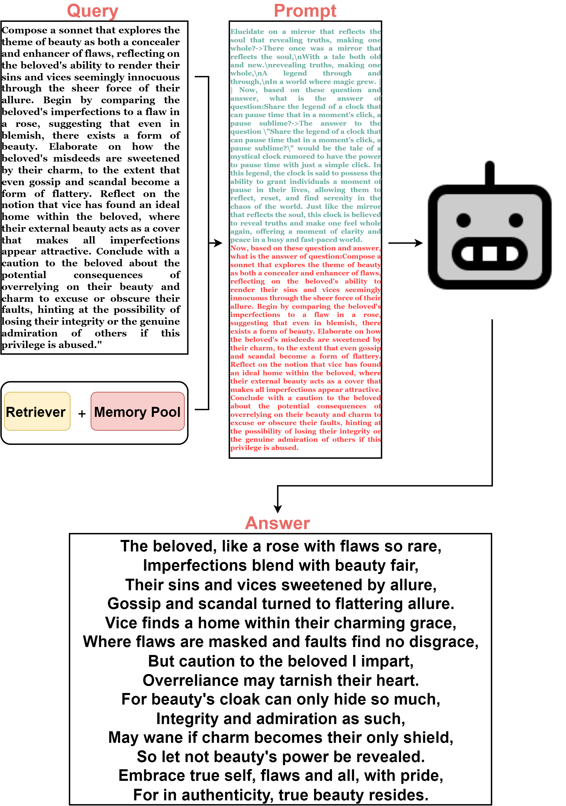

## Interactive Memory Sharing for Large Language Models

  

The adaptation of Large Language Models (LLMs) to execute tasks via natural language prompts represents a significant advancement, notably eliminating the need for explicit retraining or fine tuning, but are constrained by the comprehensiveness and diversity of the provided examples, leading to outputs that often diverge significantly from expected results, especially when it comes to the open-ended questions. Although Retrieval-Augmented Generation (RAG) can effectively address this problem, its implementation may be hindered by the scarcity of suitable external databases or the insufficiency and obsolescence of examples in existing databases. This work aims to address the problem of external datasets shortage and obsolescent for databases. We proposed a novel Interactive Memory Sharing framework, which integrates the real-time memory filter, storage and retrieval to enhance the In-Context Learning process. This framework allows for the sharing of memories among LLMs, whereby the interactions and shared memories between LLMs effectively enhance the diversity of the memories. The collective self-enhancement through interactive learning among LLMs facilitates the evolution from individual intelligence to collective intelligence. Besides, the dynamically growing memory pool is utilized not only to improve the quality of responses but also to train and enhance the retriever in real-time. Extensive experiments on three distinct domains demonstrate that the INMS framework significantly improves the agents' performance in addressing open-ended questions.

**An illustration of how the agent cooperate with the MS.**

  

## Usage
**pip install -r requirments.txt**

To evaluate the performance of agents under each domain, run the Integrate.py under each directory.

**An text example of LLM answer an open-ended query**

  

